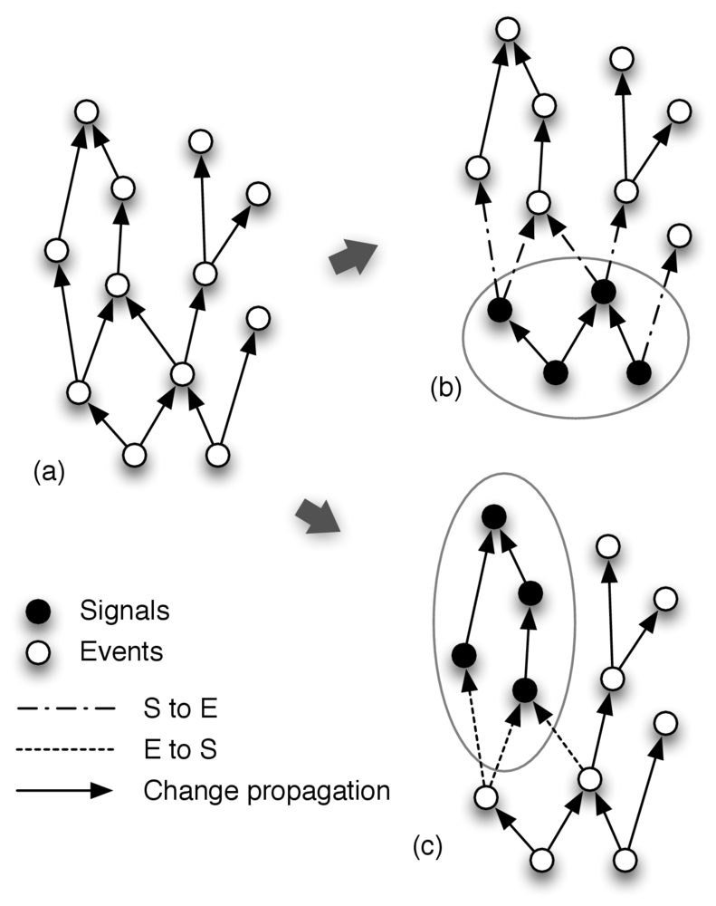

# A Reactive Language for the Object-oriented World
Software applications must react to external changes such
as the input from the user and network
messages. Traditionally, object-oriented software adopts
the Observer pattern to implement reactivity and decouple
the observers from the observables. Whereas researchers
have highlighted the drawbacks of this style for a long
time, alternatives struggle to be widely accepted. In
particular, functional reactive programming and dataflow
programming – which aim to represent time-changing values
as first class abstractions – are promising, but hardly
escape the functional setting. On the other hand,
event-based languages directly support events but do not
achieve the declarative style of more functional
approaches.

REScala is a reactive language which integrates concepts
from event-based and functional-reactive programming into
the object-oriented world. REScala supports the development
of reactive applications by fostering a functional and
declarative style which complements the advantages of
object-oriented design. Events and signals have their
advantages and disadvantages and event-based applications
cannot be refactored to use only signals without loss of
desired properties. We derive that there is a need for a
language design that supports a fluid transition between the
two worlds and seamlessly integrates them into the OO
setting.

REScala provides a rich API of functions for converting
events to signals and the other way around. The goal is to
ensure that the same abstraction/composition mechanisms
uniformly apply over them. Conversion functions also
facilitate refactoring of code fragments from one style to
the other.

# The Role of Conversion Functions
{: width="420"}
We graphically depict event-based applications as a graph
(Figure a), in which the nodes without a predecessor denote directly
triggered events on which other events (indirectly) depend (inner
nodes of the graph). Functions converting from events to signals are
used to refactor some reactive functionality to signals, in cases when
reactivity originates from events, graphically depicted in Figure c.
Functions converting from a signal to an event are used when some
piece of reactive functionality that is refactored to use signals
still needs to interface to events, graphically depicted in Figure a.

