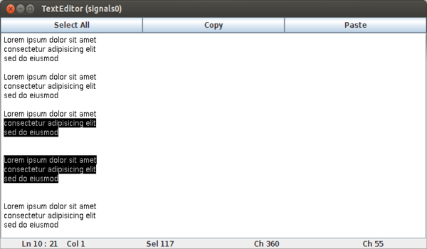

# React Edit
{: width="480" height="280"}
ReactEdit is a minimal text editor implementing
functionalities like text selection, line counting, and
cutting-and-pasting of text.

ReactEdit is a minimal version of the Editor widget in the
SWT library, which is malleable to investigating various
design alternatives based on reactive abstractions.

---
ReactEdit on GitHub:  
[https://github.com/guidosalva/editor](https://github.com/guidosalva/editor)